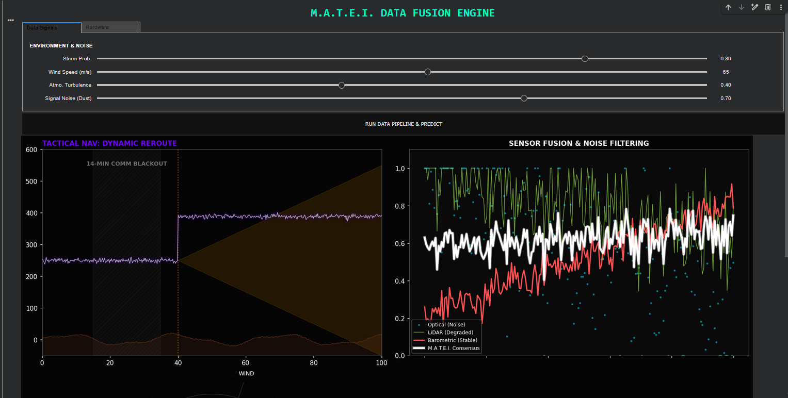
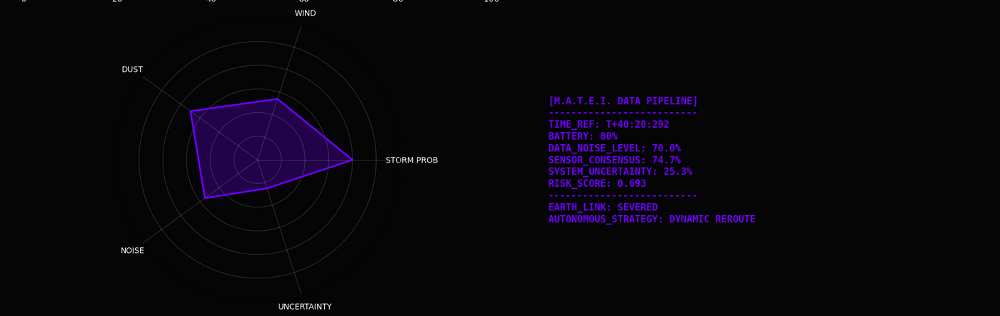

Mission Control Dashboard and Sensor Fusion Simulator

Project Overview
M.A.T.E.I. (Monitorizare Autonoma si Tactici de Evolutie Inteligenta) is a flight decision engine designed for Martian drones. The core challenge is navigating a 14-minute communication blackout where Earth cannot intervene. This project simulates a Weighted Sensor Fusion algorithm that extracts truth from noisy data during dust storms to decide if a drone should proceed, reroute, or execute an emergency landing.

Key Features

  -Sensor Fusion Logic: Combines Optical, LiDAR, and Barometric data to calculate a real-time Confidence Score.

  -Post-Flight Analytics Dashboard: A 4-panel visual suite showing Trajectory, Sensor Noise, Risk Matrices, and Telemetry Logs.

  -Edge Case Simulation: Handles variables like Payload Fragility, Atmospheric Turbulence, and Signal Degradation.

The Brain: Weighted Consensus Algorithm
The system does not trust a single sensor. It uses a weighted approach based on environmental reliability:

  -Optical : Low trust during storms due to dust blindness.

  -LiDAR : Medium trust; active laser sensing but prone to particle scatter.

  -Barometer : High trust; atmospheric pressure is the most reliable ground truth during Mars storms.

